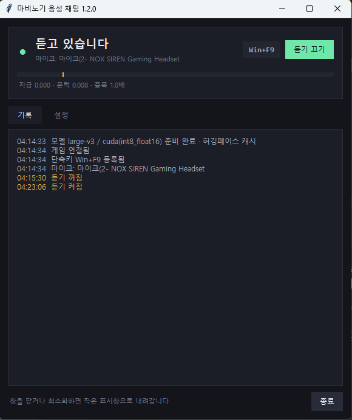
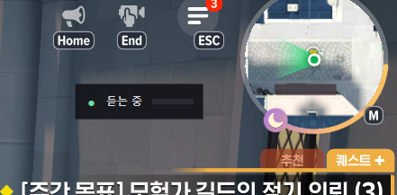
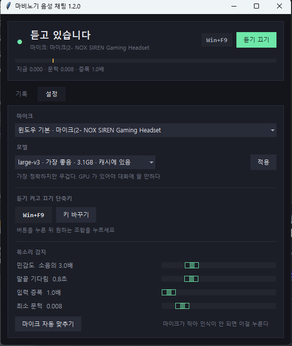

# 마비노기 모바일 음성 채팅

**말하면 그대로 게임 채팅으로 나갑니다.** 타자를 치지 않아도 됩니다.

```
(마이크에) "파티 구해요 던전 같이 가실 분"
        ↓
게임 채팅창에  파티 구해요 던전 같이 가실 분
```

말소리를 알아서 감지합니다. 말을 시작하면 녹음하고, 잠깐 조용해지면 한 마디가
끝난 것으로 보고 글로 바꿔 보냅니다. 버튼을 누르고 있을 필요가 없습니다.

<p align="center">
  
</p>

게임 위에는 작은 표시창만 남겨 둘 수 있습니다.

<p align="center">
  
</p>

## 필요한 것

| | |
|---|---|
| 운영체제 | 윈도우 10 또는 11 |
| 마이크 | 아무 것이나 괜찮습니다 |
| 게임 | 마비노기 모바일 **PC 클라이언트** |
| 그래픽카드 | 없어도 됩니다. NVIDIA 가 있으면 훨씬 빠릅니다 |
| 디스크 | 1.5 ~ 4 GB |

파이썬을 미리 깔지 않아도 됩니다. 프로그램이 자기 것을 따로 들고 옵니다.

## 시작하기

**1. 게임 설정에서 `MM AI 에이전트 활성화` 를 켜 주세요.**
이걸 켜지 않으면 채팅을 보낼 수 없습니다. 켜면 게임이 필요한 파일을 알아서
깔아 줍니다.

**2. `실행.bat` 을 두 번 누르세요.**
첫 실행은 준비하는 데 시간이 걸립니다. 파이썬(45MB), 필요한 꾸러미(약 400MB),
음성 인식 모델(0.5~3GB)을 받습니다. 한 번만 겪으면 됩니다. NVIDIA 그래픽카드가
있으면 GPU 가속(550MB)을 받을지 물어봅니다.

**3. 처음에는 연습 모드로 해 보세요.**
**설정** 탭에서 **연습 모드**를 켜면 인식만 하고 채팅으로 보내지 않습니다. 말이
어디서 끊기는지 안전하게 확인할 수 있습니다. 감이 잡히면 끄시면 됩니다.

## 쓰는 법

- **말하면 나갑니다.** 보내기 전에 확인하는 단계는 없습니다.
- **Win+F9** 로 듣기를 켜고 끕니다. 게임이 앞에 있어도 먹힙니다.
- 창을 닫거나 최소화하면 작은 표시창으로 내려갑니다. 완전히 끄려면 트레이
  아이콘에서 **종료**를 누르세요.

> **자리를 비울 때는 꼭 듣기를 끄세요.**
> 켜 둔 채로 두면 방 안에서 하는 모든 말이 공개 채팅에 그대로 올라갑니다.
> 통화나 혼잣말도 마찬가지고, 되돌릴 수 없습니다.

### 창

위쪽 칸은 늘 보입니다. 음량 막대의 **초록은 지금 들어오는 소리**, **주황 선은
말소리로 인정하는 문턱**입니다. 초록이 주황을 넘으면 녹음이 시작됩니다. 아래에
실제 숫자도 적히니, 말해도 초록이 주황에 닿지 않으면 마이크가 작은 것입니다.

아래는 **기록** 과 **설정** 두 탭입니다.

<p align="center">
  
</p>

| 설정 | 무엇 |
|---|---|
| 마이크 | 장치를 바꾸면 곧바로 바뀝니다 |
| 모델 | 아래 「모델 고르기」를 보세요 |
| 단축키 | 버튼을 누른 뒤 원하는 조합을 누르면 바로 바뀝니다 |
| 민감도 | 게임 소리에 헛발질하면 올리세요 |
| 말끝 기다림 | 말이 잘리면 늘리세요 |
| 입력 증폭 · 최소 문턱 | 마이크가 작을 때 만집니다 |
| 마이크 자동 맞추기 | 3초 동안 말하면 위 두 값을 알맞게 잡아 줍니다 |
| 연습 모드 | 인식만 하고 보내지 않습니다 |

### 작은 표시창

창을 내리면 화면 위에 작게 떠 있습니다. 끌어서 옮기면 자리를 기억하고, 왼쪽
클릭으로 큰 창을 열고, 오른쪽 클릭으로 듣기를 켜고 끕니다.

전체화면을 독점 방식으로 쓰는 게임 위에는 뜨지 않습니다. 테두리 없는 창 모드로
하시면 잘 보입니다.

## 모델 고르기

말을 글로 바꾸는 부분입니다. 큰 것이 정확하지만 무겁습니다.

| 모델 | 크기 | 한국어 | 쓸 곳 |
|---|---|---|---|
| small | 0.5 GB | 보통 | **그래픽카드가 없을 때** |
| medium | 1.5 GB | 좋음 | 무난합니다 |
| large-v3-turbo | 1.6 GB | 매우 좋음 | **대부분 이걸 권합니다** |
| large-v3 | 3.1 GB | 가장 좋음 | 그래픽카드 메모리가 넉넉할 때 |

처음 실행하면 이 PC 형편을 보고 하나를 골라 줍니다. **설정** 탭에서 바꿀 수
있고, 한 번 받은 모델은 계속 씁니다. 판을 올려도 다시 받지 않습니다.

100% 에 닿은 뒤 잠깐 「받은 파일을 맞추는 중」 이 붙습니다. 멈춘 것이 아니니
기다려 주세요.

**그래픽카드가 없으면 `small` 을 쓰세요.** 큰 모델은 말보다 인식이 한참 늦어서
대화에 쓸 수 없습니다.

## 알아 둘 것

- **채팅을 읽지 못합니다.** 게임이 읽는 기능을 열어 주지 않았습니다. 그래서 남의
  말에 자동으로 답하는 것은 불가능하고, 이 프로그램은 **내 말을 보내는** 것만
  합니다.
- **채널을 고를 수 없습니다.** 게임에서 지금 열어 둔 채팅창으로 나갑니다. 길드로
  말하려면 게임에서 채널을 길드로 바꿔 두세요.
- **한 줄은 50자까지입니다.** 말이 길면 여러 줄로 쪼개 조금씩 띄워 보냅니다.
- **음성 인식은 틀릴 때가 있습니다.** 확인 단계가 없으므로 잘못 들은 말이 그대로
  공개 채팅에 올라갑니다. 짧은 소리(기침·클릭), 한 글자로만 인식된 것, 침묵에
  붙는 헛문장, 5초 안의 같은 말은 걸러내지만 완벽하지는 않습니다.
- 보낸 말은 `sent.log` 에 남으니 나중에 되짚을 수 있습니다.

한 글자를 걸러내기 때문에 "오" "아" 같은 감탄사는 나가지 않습니다.

## 문제가 생기면

**말해도 아무 반응이 없어요**
마이크가 작아서 말로 인정받지 못하는 경우입니다. **설정** 탭의 **마이크 자동
맞추기** 를 누르고 3초 동안 평소 말투로 말해 주세요. 그래도 음량 막대가 거의
움직이지 않으면 윈도우 설정의 소리 > 입력에서 음소거와 볼륨을 확인해 주세요.

**창이 안 뜨거나 바로 닫혀요**
`scripts\콘솔로_실행.bat` 으로 띄우면 검은 창에 무엇이 잘못됐는지 나옵니다.

**게임 조작 프로그램을 찾지 못했다고 해요**
먼저 게임 설정의 **MM AI 에이전트 활성화**가 켜져 있는지 보세요. 켜 두었는데도
그러면 **설정** 탭 맨 아래에서 **다시 찾기** → **디스크에서 찾기** → **직접
지정** 을 순서대로 해 보시면 됩니다.

**채팅이 두 번씩 나가요**
프로그램이 두 개 돌고 있습니다. 트레이 아이콘이 두 개인지 보고 하나를 종료해
주세요. 창이 안 보여도 배경에서 듣고 있을 수 있습니다.

**단축키가 게임 안에서 안 먹혀요**
`scripts\관리자로_실행.bat` 으로 띄우면 게임과 같은 권한이 되어 키가 전달됩니다.
다른 프로그램이 같은 조합을 쓰고 있을 수도 있으니, 그럴 때는 조합을 바꿔 보세요.

**인식이 느려요**
그래픽카드를 쓰지 않고 있을 가능성이 큽니다. NVIDIA 그래픽카드가 있으면
`scripts\GPU로_바꾸기.bat` 을 한 번 실행하시고, 없으면 모델을 `small` 로
내려 주세요.

**말이 중간에 잘려요 / 안 한 말이 나가요**
말이 잘리면 **말끝 기다림**을 늘리고, 잡음에 헛발질하면 **민감도**를 올리거나
**입력 증폭**을 내려 주세요.

## 판을 올릴 때

**옛 폴더에 그대로 덮어쓰시면 됩니다.** 모델과 설정은 그대로 남습니다.

## 라이선스

[MIT](LICENSE). 마음대로 갖다 쓰고 고치고 나눠도 됩니다. 저작권 표시와 라이선스
글만 함께 남겨 주세요. 보증은 없고, 이 프로그램을 써서 생긴 일에 만든 사람은
책임지지 않습니다.
