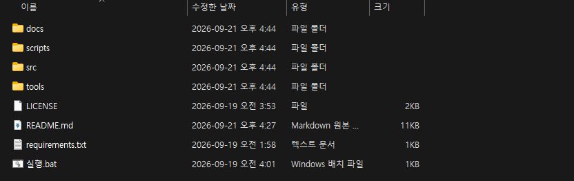

# 마비노기 음성 채팅 — 설치 가이드

**말하면 그대로 게임 채팅창에 글로 올라가는 프로그램입니다.**
타자를 치지 않아도 되니, 레이드 중이나 손이 바쁠 때 쓰기 좋습니다.

이 글은 **컴퓨터를 잘 모르셔도 따라 하실 수 있게** 썼습니다. 순서대로만 하시면 됩니다.

---

## 시작하기 전에

| 필요한 것 | 설명 |
|---|---|
| 윈도우 10 또는 11 | 맥은 안 됩니다 |
| 마이크 | 헤드셋에 달린 것으로 충분합니다 |
| 마비노기 모바일 **PC 버전** | 휴대폰 말고 컴퓨터로 하는 것 |
| 인터넷 | 처음 한 번 1~2GB 정도 받습니다 |
| 빈 공간 2~4GB | |

**그래픽카드는 없어도 됩니다.** 있으면 더 빠를 뿐입니다.

처음 준비하는 데 **10분에서 20분쯤** 걸립니다. 인터넷 속도에 따라 다릅니다.
한 번만 하면 되고, 다음부터는 바로 켜집니다.

---

## 1단계 — 게임에서 스위치를 켭니다

**이걸 안 켜면 아무것도 안 됩니다.** 제일 먼저 해 주세요.

1. 마비노기 모바일 PC 버전을 켭니다
2. 게임 설정으로 들어갑니다
3. **「MM AI 에이전트 활성화」** 를 찾아서 켭니다

<!-- 사진 자리: docs/images/guide/01_게임설정.png -->

> 이 스위치를 켜면 게임이 **필요한 파일을 알아서 깔아 줍니다.**
> 그 파일이 있어야 우리 프로그램이 게임에 말을 걸 수 있습니다.

---

## 2단계 — 파일을 받습니다

아래 주소로 들어갑니다.

```
https://github.com/Git-seokwon/mabi-voice-chat/releases/latest
```

내려가다 보면 **Assets** 라고 적힌 곳이 있습니다. 그 아래
**`mabi-voice-chat-...zip`** 을 누르면 받아집니다.

> 영어로 된 페이지라 낯설 수 있는데, **`.zip` 으로 끝나는 것** 하나만 누르시면 됩니다.
> 크기는 200KB 정도로 아주 작습니다. 무거운 것은 나중에 알아서 받습니다.

---

## 3단계 — 압축을 풉니다

받은 파일에 **오른쪽 클릭 → 「압축 풀기」** 를 누릅니다.

바탕화면이나 `내 문서` 처럼 **찾기 쉬운 곳**에 푸세요.
나중에 켤 때마다 이 폴더를 열어야 합니다.

> **`C:\Program Files` 안에는 넣지 마세요.** 윈도우가 막아서 설치가 안 됩니다.

풀고 나면 이런 파일들이 보입니다.



여기서 쓸 것은 **`실행.bat`** 하나뿐입니다. 나머지는 건드리지 않으셔도 됩니다.

---

## 4단계 — `실행.bat` 을 두 번 누릅니다

**검은 창이 뜨는데 놀라지 마세요.** 필요한 것을 받는 중입니다.

창에는 이런 글씨가 지나갑니다.

```
============================================
  Mabinogi Voice Chat - first run setup
============================================

[1/4] Python runtime
      downloading about 45 MB ...
[2/4] packages (this downloads a few hundred MB, please wait)
[3/4] checking
      all imports OK
```

**중간에 끄지 마세요.** 10~20분 걸립니다. 그동안 다른 일 하셔도 됩니다.

### 그래픽카드가 있으면 물어봅니다

중간에 이런 질문이 나올 수 있습니다.

```
[4/4] GPU acceleration (optional)
      An NVIDIA GPU was found.
Install it now (30s -> yes) [Y,N]?
```

**`Y` 를 누르고 엔터** 를 치세요. 550MB 를 더 받지만 **말을 알아듣는 속도가 몇 배 빨라집니다.**
30초 동안 가만히 두셔도 알아서 `Y` 로 넘어갑니다.

이 질문이 안 나오면 그래픽카드가 없다는 뜻입니다. 그래도 잘 돌아가니 걱정 마세요.
(다만 6단계에서 모델을 `small` 로 바꿔 주세요.)

---

## 5단계 — 창이 뜹니다

준비가 끝나면 이런 창이 나옵니다.


왼쪽 위 **초록 동그라미와 「듣고 있습니다」** 가 보이면 잘 켜진 것입니다.

- 가운데 **초록 막대**는 지금 마이크에 들어오는 소리입니다
- 그 위의 **주황 선**은 "이만큼 크면 말로 친다" 는 기준입니다
- **말했을 때 초록이 주황을 넘어야** 알아듣습니다

말해 보시고 초록 막대가 거의 안 움직이면 → **9단계**를 보세요.

---

## 6단계 — 처음엔 연습 모드로

바로 채팅에 보내면 잘못 들은 말이 그대로 올라갑니다. **처음엔 연습부터** 하세요.

1. 창에서 **「설정」** 을 누릅니다
2. 아래로 내리면 **「연습 모드」** 가 있습니다. 체크합니다


이제 말해 보세요. **「기록」** 탭에 알아들은 말이 찍히는데, **채팅으로는 안 나갑니다.**

몇 번 해 보시고 잘 알아들으면 **연습 모드를 끄세요.** 그때부터 진짜로 나갑니다.

### 그래픽카드가 없으시면

설정의 **「모델」** 에서 **`small`** 을 고르고 **「적용」** 을 누르세요.
큰 것은 말보다 한참 늦게 알아들어서 대화에 못 씁니다.

---

## 7단계 — 이제 쓰시면 됩니다

- **말하면 채팅으로 나갑니다.** 확인 과정은 없습니다
- **Win 키 + F9** 를 누르면 듣기를 껐다 켭니다. **게임 중에도 먹힙니다**
- 창을 닫거나 최소화하면 **작은 표시창**만 남습니다


이 작은 창은 **게임 위에도 떠 있습니다.** 초록 점이면 듣는 중입니다.
끌어서 원하는 자리에 두시면 그 자리를 기억합니다.

> **자리를 비울 때는 꼭 Win+F9 로 꺼 주세요.**
> 켜 둔 채로 두면 옆 사람과 하는 말, 통화, 혼잣말까지 전부 채팅에 올라갑니다.
> 한 번 나간 말은 지울 수 없습니다.

---

## 8단계 — 알아듣는 힘을 높이려면

설정의 **「자주 쓰는 말」** 에 게임 낱말을 쉼표로 적어 두세요.
그런 말이 나올 거라고 미리 알려 주면 훨씬 잘 알아듣습니다.

```
자주 쓰는 말 :  키아, 라비, 어비스, 바리
고쳐 쓰기    :  던젼>던전, 파뤼>파티
```

**「고쳐 쓰기」** 는 자꾸 틀리게 듣는 말을 보내기 직전에 바로잡아 줍니다.
`틀린말>바른말` 꼴로 적으시면 됩니다.

---

## 9단계 — 잘 안 될 때

### 말해도 아무 반응이 없어요

마이크 소리가 작아서 말로 인정받지 못하는 것입니다. **제일 흔한 경우입니다.**

설정 탭의 **「마이크 자동 맞추기」** 를 누르고, **3초 동안 평소 말투로** 말해 주세요.
알아서 소리를 키우고 기준을 낮춰 줍니다.

그래도 초록 막대가 안 움직이면 마이크가 막힌 것입니다.
윈도우 **설정 → 시스템 → 소리 → 입력**에서 음소거와 볼륨을 확인해 주세요.
헤드셋에 음소거 버튼이 달려 있는 경우도 많습니다.

### 창이 안 뜨거나 바로 닫혀요

`scripts` 폴더의 **`콘솔로_실행.bat`** 을 눌러 보세요.
검은 창에 무엇이 잘못됐는지 나옵니다.

### 「게임 조작 프로그램을 찾지 못했습니다」

1단계의 **「MM AI 에이전트 활성화」** 가 켜져 있는지 먼저 보세요.
켜 두었는데도 그러면 설정 탭 맨 아래에서
**「다시 찾기」 → 「디스크에서 찾기」 → 「직접 지정」** 순서로 눌러 보세요.

### 채팅이 두 번씩 나가요

프로그램이 두 개 켜져 있는 것입니다.
화면 오른쪽 아래 시계 옆 **트레이 아이콘**이 두 개인지 보고, 하나를 종료해 주세요.

### Win+F9 가 게임 안에서 안 먹혀요

`scripts` 폴더의 **`관리자로_실행.bat`** 으로 켜 보세요.
게임과 같은 권한이 되어 키가 전달됩니다.

### 말이 중간에 잘려요

설정의 **「말끝 기다림」** 을 늘려 주세요.
반대로 잡음에 반응하면 **「민감도」** 를 올리시면 됩니다.

---

## 새 판이 나오면

**예전 폴더에 그대로 덮어쓰시면 됩니다.** 받아 둔 것과 설정은 그대로 남습니다.
새 판이 나오면 프로그램이 켜질 때 기록에 알려 드립니다.

---

## 지우고 싶으면

`scripts` 폴더의 **`삭제.bat`** 을 두 번 누르세요.
무엇이 얼마나 지워지는지 먼저 보여 주고 물어봅니다.

| 고르기 | 지우는 것 |
|---|---|
| **전부** | 프로그램과 받아 둔 것 전부 |
| **받은 것만** | 무거운 것만 지우고 설정은 남김 |

「받은 것만」 을 고르시면 나중에 `실행.bat` 을 눌렀을 때 다시 받습니다.
자리만 비우고 싶을 때 쓰시면 됩니다.

---

## 마지막으로

- 프로그램은 **자기 폴더 안에서만** 삽니다. 컴퓨터의 다른 곳은 건드리지 않습니다
- 이미 쓰고 계신 파이썬이 있어도 **손대지 않습니다**
- 보낸 말은 전부 `sent.log` 파일에 남으니 나중에 되짚어 보실 수 있습니다

막히는 곳이 있으면 어느 단계에서 막혔는지 알려 주세요.
