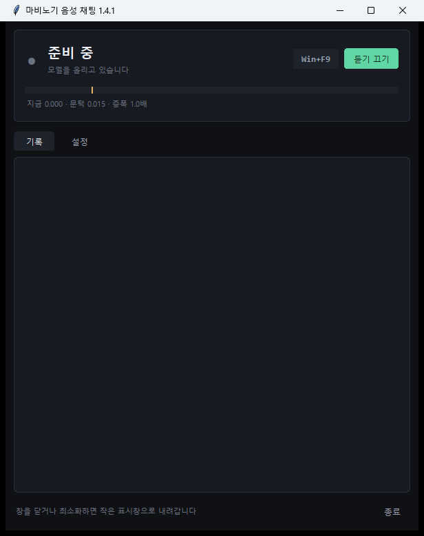
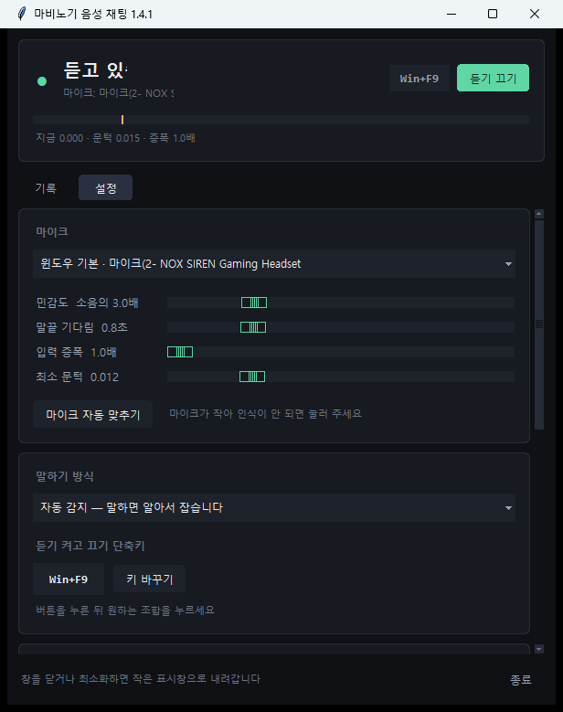

# 말하면 채팅이 쳐집니다 — 마비노기 음성 채팅

마이크에 말하면 **그대로 게임 채팅창에 글로 올라가는** 프로그램을 만들었습니다.
타자를 안 쳐도 됩니다.

```
(마이크에) "파티 구해요 던전 같이 가실 분"
        ↓
게임 채팅창에  파티 구해요 던전 같이 가실 분
```

무료이고, 소스도 전부 공개해 두었습니다.



---

## 이런 때 쓰면 좋습니다

### 1. 레이드나 어비스에서

손이 바쁠 때 채팅을 치려면 손을 떼야 합니다. 그게 싫어서 만들었습니다.

**키 입력과 상관없이 돌아갑니다.** 채팅창을 열 필요도, 조작을 멈출 필요도 없습니다.
말만 하면 됩니다.

### 2. 다른 일 하면서

**창이 앞에 없어도 됩니다.** 게임이 뒤에 있어도, 다른 프로그램을 쓰고 있어도
마이크에 말하면 채팅이 나갑니다.

작업하다가 "잠깐만요" 한마디 넣는 게 됩니다. 하던 일을 멈추지 않아도 됩니다.

### 3. 디스코드 대신

서로 목소리를 들려줄 필요가 없는 사이라면 이쪽이 편합니다.
**내 말은 글로 바뀌어 나가고**, 상대는 그냥 게임 채팅으로 읽습니다.

통화를 켜기 애매한 사이, 마이크를 켜기 부담스러운 자리에서 쓸 만합니다.

---

## 어떻게 생겼나

말소리를 **알아서 감지합니다.** 말을 시작하면 녹음하고, 잠깐 조용해지면
한마디가 끝난 걸로 보고 글로 바꿔 보냅니다. 버튼을 누르고 있을 필요가 없습니다.

사람이 많은 자리에서는 **눌러서 말하기**로 바꿀 수 있습니다.
단축키로 시작하고 다시 눌러 끝내는 방식이라, 말하려고 마음먹은 것만 나갑니다.

창을 내리면 **작은 표시창**만 남습니다. 게임 위에도 떠 있어서 지금 듣는 중인지 보입니다.


**Win+F9** 로 듣기를 껐다 켤 수 있고, **게임 중에도 먹힙니다.**

말을 알아듣는 힘은 설정에서 손볼 수 있습니다. 게임 낱말을 적어 두면
(`키아, 라비, 어비스` 처럼) 훨씬 잘 알아듣고, 자꾸 틀리는 말은
`던젼>던전` 식으로 고쳐 쓰게 할 수 있습니다.



---

## 미리 알아 두셔야 할 것

솔직하게 적겠습니다. 이런 걸 감수하실 수 있으면 쓰시면 됩니다.

### 주변 채팅으로만 나갑니다

게임이 열어 준 기능의 한계입니다. **채널을 고를 수가 없어서**,
지금 열려 있는 채팅창으로 나갑니다. 길드로 보내고 싶으면
게임에서 채널을 길드로 바꿔 두셔야 합니다.

나중에 게임 쪽 기능이 늘어나면 그때 반영하겠습니다.

### 버그 대응이 느릴 수 있습니다

**개발자가 '개딸깍' 개발자라 잘 모릅니다.** 고치는 데 시간이 걸릴 수 있습니다.
그래도 알려 주시면 고쳐 보겠습니다.

### AMD 그래픽카드는 가속이 안 됩니다

쓰는 음성 인식 엔진이 **엔비디아(CUDA) 전용**이라 그렇습니다.
AMD·인텔 그래픽카드는 가속에 못 씁니다.

**다만 그래픽카드 없이 CPU 만으로도 돌아갑니다.** 이 경우 설정에서
작은 모델(`small`)을 고르시면 쓸 만합니다.

### 다른 음성 인식 서비스는 못 붙입니다

지금은 프로그램에 들어 있는 것만 씁니다. 원하시는 분이 많으면 붙일 수는 있는데,
**지금 것으로도 충분히 돌아가서** 당장은 계획이 없습니다.

### 그리고 하나 더

**확인 과정이 없습니다.** 잘못 들은 말이 그대로 공개 채팅에 올라갑니다.
자리를 비울 때는 꼭 꺼 주세요. 옆 사람과 하는 말, 통화, 혼잣말까지 다 나갑니다.

처음 쓰실 땐 **연습 모드**를 켜고 감을 잡으시길 권합니다.
알아듣기만 하고 채팅으로는 안 보냅니다.

---

## 받는 곳

```
https://github.com/Git-seokwon/mabi-voice-chat/releases/latest
```

**압축을 풀고 `실행.bat` 을 두 번 누르면 됩니다.**
처음 한 번만 필요한 것을 받느라 10~20분쯤 걸립니다. 다음부터는 바로 켜집니다.

**게임 설정에서 「MM AI 에이전트 활성화」 를 먼저 켜 주세요.** 이걸 안 켜면 안 됩니다.

자세한 설치 방법은 설치 가이드에 그림과 함께 적어 두었습니다.

---

## 만든 이야기

넥슨이 마비노기 모바일에 AI 에이전트 기능을 열어 둔 걸 보고,
"그럼 말로 채팅을 칠 수 있지 않나" 싶어 만들기 시작했습니다.

만들다 보니 제 컴퓨터에서만 되는 것들이 잔뜩 나왔습니다.
친구에게 보내 봤더니 세 번 연속으로 다른 데서 터지더군요.
덕분에 그래픽카드 문제, 설치 경로 문제, 진행률이 200%까지 차오르던 버그를 잡았습니다.

무료이고 소스도 공개해 두었습니다. 마음대로 갖다 쓰셔도 됩니다.
보증은 없고, 쓰시다 생긴 일에는 책임지지 못합니다.
